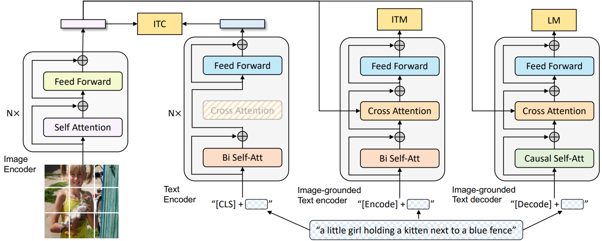
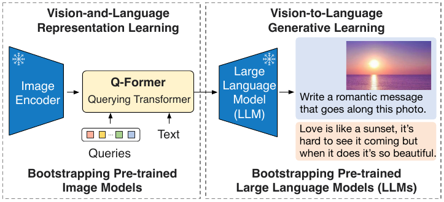

# 이미지 자동생성 관련 조사(Blip)

## 선행 연구

- VLP(vision-language Pre-training)
- vision과 language의 multimodality를 활용한 학습을 진행하는 것
- understanding based task(Encoding을 통해 downstream task를 해결하는 구조) 
    Or generation based task(Decoding을 통해 특정 modality를 생성하는 구조)로 학습을 진행
- BLIP paper에서 제시하고자 하는 것은 새로운 VLP framework를 제시하여 앞서 말했던 understanding task와 generation task 함께 학습할 수 있게끔 하는 것
- 저자들이 제시한 것은 generation task에서 사용될 수 있는 **decoder**와 understanding task에서 사용될 수 있는 **encoder**를 일종의 caption synthesizer와 caption filter로 사용한 것

## BLIP-1

## Model Architecture

- MED(Multimodal mixture of encoder-decoder) Training 구조를 가짐, 크게 3가지 구조를 가짐.
- image와 text embedding 사이의 contrastive learning을 위해 unimodal encoder를 image domain과 text domain에 대해서 사용, **Image domain**에서의 encoder는 Vision transformer를 사용하고 **text encoder**는 BERT를 사용
- 특정 image를 기반으로 유의미한 caption을 필터링하기 위한 understanding module로 image-grounded text encoder를 사용, mage-grounded text encoder는 위의 그림에서 중간에 cross-attention layer를 통해 image embedding 정보를 
text encoder에서 활용함으로써 이미지와 텍스트의 matching 정도를 임베딩 수치로 내놓음.
- image를 기반으로 synthesized caption을 augmentation(논문에서 사용한 용어를 토대로 정정하자면, dataset bootstrapping) 방법으로 사용하기 위해 설계한 text decoder, (그림 제일 오른쪽)

## Pre-training objectives

# ITC(image-text contrastive loss)
- visual transformers(맨왼쪽), text transformer(왼쪽에서 2번째)가 서로 positive pair(image와 text description이 일치하는 경우)라면 가깝게, negative pair(일치하지 않는 모든 경우)라면 멀게 encoding하게끔 unimodal encoder를 학습함,
- Vision과 text에 대한 understanding을 improving할 수 있는 방법으로 대부분 VLP에서 진행하는 contrastive learning과정
# ITM(image-text matching loss)
- image grounded text encoder를 학습하는 과정이고 binary classification task를 수행.
- Encoder가 추출하는 prediction은 unimodel vision encoder에서 획득할 수 있는 semantic 정보를 text embedding과의 attention을 통해 주어진 text가 image에 positive(match)인지 negative(unmatch)인지 구분하는 task
- 그러나 BCE task로 접근하면 contrastive loss와는 다르게 negative sample의 어려움 정도에 따라 loss optimization이 진행될 수 없기 때문에 hard negative mining strategy를 통해 분류가 어려운 negative sample이 학습에 더 많은 관여를 하게끔 처리함.
# LM(Language modeling loss)
- image grounded text decoder를 사용하게되고, autoregressive한 방법으로 text input에 대해 cross-entropy loss를 최적화함.
- VLP에서 사용되는 MLM loss와는 다르게 LM loss는 visual information을 기반으로 유의미한 caption을 생성할 수 있게끔 학습 가능.
# Dataset
- 데이터셋의 퀄리티를 높이기 위해서 human annotated(high quality dataset)인**(Ih,Th)** 그리고
    **(Iw,Tw)(web-crawled dataset)** 를 같이 사용한다.

## 한계점

- pre-training 과정에서 parameter를 공유하는 방법을 통해 전체적으로 학습이 되는(fine-tuning) 네트워크를 단순화했다는 점에서는 어느 정도 장점이 있지만, 그럼에도 불구하고 여전히 end-to-end로 네트워크를 학습해야하는 방법론에서는 벗어나지 못함

## Blip-2 

[summary]
- BLIP 논문이 총 4개의 transformer block 구조를 각각 optimize하는 형태라면, Blip-2 process는 
단순히 2 step의 pre-training 과정을 통해 vision과 language의 alignment가 가능하다고 주장
- 기존 VLP의 한계점을 극복하고자 frozen unimodal models인 image encoder, LLM을 활용할 수 있는 방법으로 modality 사이에 Q-former(Querying Transformer)를 제안하였으며, 이 구조는 image encoder에서 나온 embedding에서 LLM에 유용하게 사용될 수 있는 embedding을 추출해내고, 이를 통해 LLM 성능을 높이고자 한 것
- Q-former는 앞의 image encoder나 뒤의 text decoder를 굳이 학습할 필요가 없다는 점에서 module과 관련된 모든 연구들의 장점(효율적, lightweight)을 가지고 있으며 그와 동시에 vision과 language 사이에 유의미한 modality relationship을 간단한 학습 구조로 찾을 수 있다는 것을 밝혀

## Contribution

- BLIP-2는 frozen pre-trained image and text network를 **효율적으로 사용**하면서 Q-former를 통해 **modality gap을 줄일 수 있는 방법**을 제시.
- 학습 방법은 representation learning stage와 text generative learning stage로 구분함
- OPT, FlanT5와 같은 성능 좋은 LLMs을 기반으로 BLIP-2는 zero-shot image to text generation을 진행.
보다 좋은 LLM을 사용하여 좋은 visual knowledge reasoning, visual conversation이 진행될 수 있다는 것은 앞으로도 BLIP-2가 제안한 모듈을 통해 확장성 있는 접근이 가능하고, 이를 통해 vision language task의 성능을 높일 수 있다는 가능성이 있음. **즉, scalable한 approach**이다.
- Frozen unimodal models를 사용하고 lightweight Q-former를 학습함으로써 BLIP-2는 compute-efficient하게 성능을 높일 수 있음. 
예를 들어 BLIP-2는 앞서 소개했던 Flamingo보다 zero-shot VQA 성능이 **8.7%8.7%**가 높았으며, 심지어 **54배 적은 parameter 수로 이를 충족**할 수 있었다.

## Method

- Q-former 는 같은 셀프어텐션층을 공유하는 **두개의 트랜스포머하위구조**로 이루어져 있음
- **Q-former**는 학습이 가능한 querry를 가지고 있으며, 이 querry들은 이미지에서 특정 text가 주어졌을때 
alignement에 활용될 수 있는 feature를 추출해주는 역할을 함
- Q-former가 없었던 BLIP 논문에서는 image-text matching, image-text contrastive learning 그리고 image-grounded text generation 모두 서로 다른 loss term으로 서로 다른 network(물론 text encoder와 decoder가 같은 weight으로 학습되었지만)를 최적화하는 방식이었지만, BLIP-2에서는 Q-Former의 encoder-decoder 구조에 대해서 causality만 조절해줌으로써 encoder에서와 decoder에서 각각의 task에 맞는 optimization이 진행될 수 있다는 장점이 있다

## Training

- 학습은 두 단계로 이루어 지고, Q-former를 frozen image encoder와 연결하여 image-text pair를 통해 학습
- 처음 단계 학습은 Q-former가 가지는 학습 가능한 parameter인 querry를 잘 학습하여 visual representation으로부터 
text prompt와 유의미한 관계를 가지는 특징을 추출하고자 하는 것
- 앞선 단계에서 Frozon image encoder와 Q-former 사이의 representation alignment가 이루어 졌고 
다음으로 Q-former와 frozen LLM 사이의 alignment 작업 진행
- Q-former의 output embedding을 FC layer로 사영 시킨 후 LLM Model의 Input으로 사용함.
LLM이 Decoder 모델일 경우 FC Layer을 그대로 사용하고,
LLM이 Encoder-Decoder 모델일 경우 FC Layer의 결과에 정답 output text의 앞부분(Prefix Text)와 같이 넣어준다.